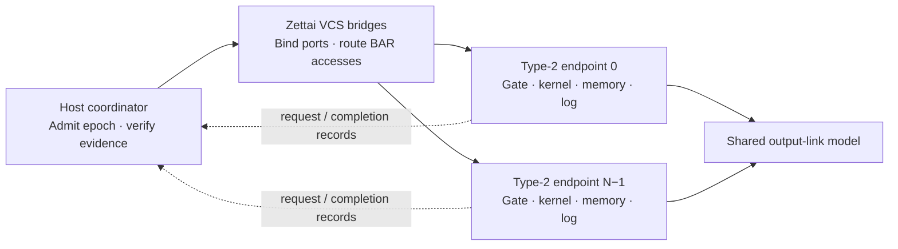

# SlugArch

**Replayable execution for composable CXL accelerators.**

[](https://github.com/SlugLab/SlugArch/actions/workflows/experiment-checks.yml)
[](LICENSE-MIT)
[](targets/splash-endpoint/)

An accelerator can write memory and then fail to record completion. Retrying the
operation may repeat an effect; accepting it may leave a gap in the execution
record. SlugArch makes that boundary explicit: **record the request before work,
record the completion before success, and preserve whether a failed operation
committed its output.**

This repository contains the replay contracts, a Rust PTX/RTL toolchain, and
reproducible multi-device experiments using Splash's QEMU Type-2 backend. The
native endpoint prototype has independent device memory, logs, timers, and error
state, with concurrent execution in simulated time.

[Quick start](#quick-start) · [Results](#results) · [Architecture](#architecture) ·
[Run the simulator](#run-the-simulator) · [Contribute](CONTRIBUTING.md)

## What you can explore

- **Endpoint enforcement:** reject work without request evidence; withhold success
  when completion recording fails after output commit.
- **Replay and attribution:** bind records to device identity, epoch, policy, and
  payload; replay full captured transfers in a fresh simulator.
- **Multi-device execution:** overlap independent endpoint jobs and expose shared
  output-link contention under an explicit timing model.
- **Zettai topology:** instantiate Type-2 devices behind real Zettai VCS bridges,
  bind ports through QMP, and verify forwarding by disabling bridge windows.
- **Scoped recovery:** preserve verified independent work before releasing the
  next epoch, with explicit restrictions on repeatable effects.

## Quick start

Run the offline validators and topology/scheduling tests with **Python 3.11+**.
No Python packages, GPU, QEMU build, or Rust toolchain are needed for these checks.

```bash
git clone https://github.com/SlugLab/SlugArch.git
cd SlugArch
python3 -m unittest discover -s targets/splash-type2 -p 'test_*.py' -v
python3 -m unittest discover -s targets/splash-bsp -p 'test_*.py' -v
python3 -m unittest discover -s targets/splash-endpoint -p 'test_*.py' -v
```

These checks exercise malformed replay records, epoch certificates, scheduling
oracles, and address/topology constraints. Full device execution requires the
custom QEMU backend described below.

## Architecture



The native gate lives inside the QEMU device model. It freezes admitted input and
descriptors, owns a bounded read-only log, and reserves a separate failure record.
A job progresses through compute, shared-link service, output commit, and completion
recording. QEMU timers control those transitions; Python verifies the resulting
bytes and timestamps against independent oracles.

Zettai supplies the actual PCI bridge forwarding and VCS binding path. Its
switch-specific arbitration and latency are **not calibrated by these experiments**;
the timing study uses a separately declared shared output-link model.

## Results

The published summaries link every result to a declared configuration and retained
run identities. The experiment drivers preserve raw outputs, endpoint records,
commands, source snapshots, executable hashes, and checksum seals in local artifacts.

| Experiment | What it establishes | Evidence |
|---|---|---|
| Multi-device capture and replay | Isolation, exact payloads, trace corruption rejection, fresh-process replay | [Results](docs/evaluation/slugarch-splash-20260919.md) |
| Native endpoint gate | Pre-/post-commit failures, peer isolation, immutable jobs, concurrent virtual-time execution | [Results](docs/evaluation/slugarch-endpoint-concurrent-20260919.md) |
| Zettai scaling to 256 endpoints | Bridge forwarding, independent endpoint state, strong/weak scaling, contention | [Results](docs/evaluation/slugarch-zettai256-20260919.md) |

The Zettai campaign passes **693 fresh processes**, **2,052 dependent rounds** and
**8,226 bridge disable/restore checks**. At 256 endpoints, fixed-total-work
virtual-time speedup is **71.04× / 14.04× / 1.24×** under the compute / balanced /
link profiles. The curves show where compute overlap gives way to link contention.


**Interpretation:** these are simulator results under stated compute/link/recording
cost assumptions, not physical CXL throughput. Inputs are resident before timing.
The native gate covers its vector-job interface; it is a fixed policy, not the
proposed programmable Hardware JIT. Older Rust/RTL endpoint summaries have a
separate evidence scope. See the linked reports for controls and limitations.

## Run the simulator

Full runs require Linux, Python 3.11+, the CXLMemSim QEMU fork with SlugArch's native
endpoint extension, and its `qemu_integration/qtest_switch_offload.py` helper.
The [endpoint guide](targets/splash-endpoint/README.md) includes the source patch,
build instructions, register map, and the original 1–8-device campaign.
The [Zettai guide](targets/splash-endpoint/ZETTAI.md) covers the 1–256-device campaign.

After building the backend:

```bash
python3 targets/splash-endpoint/scale256.py \
  --source /path/to/CXLMemSim \
  --qemu /path/to/qemu-system-x86_64 \
  --out artifact/slugarch_splash/my-zettai-run \
  --summary /tmp/slugarch-zettai-results.json \
  --workers 4
```

Use a fresh output directory. Validate a completed campaign without launching QEMU:

```bash
python3 targets/splash-endpoint/scale256.py --validate-only \
  --out artifact/slugarch_splash/my-zettai-run \
  --summary /tmp/slugarch-zettai-verified.json
```

Raw campaigns can be large and are excluded from Git. Compact summaries and figure
sources are included. Repeated virtual times are deterministic; they are not
independent samples of hardware latency.

## Repository map

| Path | Purpose |
|---|---|
| [`targets/splash-endpoint/`](targets/splash-endpoint/) | Native QEMU gate, concurrent jobs, Zettai topology, experiments and audits |
| [`targets/splash-type2/`](targets/splash-type2/) | Host recording, multi-device transport and functional replay |
| [`targets/splash-bsp/`](targets/splash-bsp/) | Epoch-certificate and pre-publication recovery experiment |
| [`crates/`](crates/) | Rust IR, PTX frontend, backend, fabric, replay and RTL integration |
| [`targets/agilex-vr2/`](targets/agilex-vr2/) | FPGA-oriented generated RTL and build inputs |
| [`docs/evaluation/`](docs/evaluation/) | Result summaries and scope of each evidence source |
| [`docs/research/`](docs/research/) | Experiment hypotheses, controls and design decisions |

The Rust/RTL stack has additional vendored inputs and build requirements; it is
separate from the Python quick start. See [external dependency notes](vendor/externals/README.md)
and the relevant crate before building the entire Cargo workspace.

## Help shape SlugArch

We welcome reproducible workloads, independent replay checks, failure cases, and
hardware measurements that can calibrate the simulator. See [CONTRIBUTING.md](CONTRIBUTING.md)
for a starting point, or open an [issue](https://github.com/SlugLab/SlugArch/issues)
with the workload or boundary you want to study.

If SlugArch is useful, starring the repository helps others discover it. If you
use the code or results in research, use [CITATION.cff](CITATION.cff) and include
the commit and experiment configuration.

SlugArch code is dual-licensed under [MIT](LICENSE-MIT) or [Apache-2.0](LICENSE-APACHE).
The QEMU extension files carry their own GPL-2.0-or-later notices; vendored
components retain their upstream licenses.
