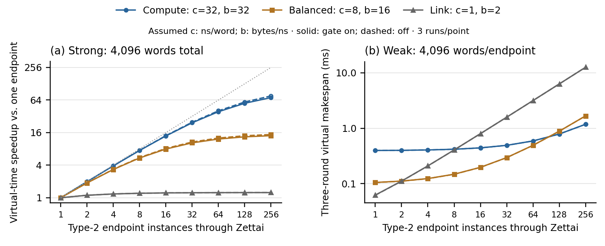

# SlugArch through Zettai: 1–256 endpoints

The complete declared campaign passed: **693 fresh QEMU processes, 2,052 dependent
execution rounds, 15,498 correctness assertions, 8,226 bridge disable/restore
checks, and 45 live injected failures**. The independent audit also rejected ten
offline evidence corruptions at 256 endpoints. Every output byte and exported
stage timestamp matched its independent value or scheduling oracle.

These are concurrent **simulated** endpoint jobs. At N=256, four actual Zettai VCS
switch objects provide four upstream and 32 downstream ports; each downstream
port carries eight independent Type-2 PCI functions. Each function owns device
memory, a native recording gate, a log, a timer and failure state. The experiment
does not represent 256 physical switch ports.

## Scaling results

Times below are QEMU virtual microseconds for **three dependent rounds**, with
resident input, gate on and a 64-ns modeled cost per record. Strong scaling fixes
4,096 total words; weak scaling fixes 4,096 words per endpoint. Each configuration
has three fresh processes with identical virtual times.

| Compute/link profile | Strong N=1 (µs) | Strong N=256 (µs) | Strong speedup | Weak N=256 (µs) | Gate overhead at N=256, strong |
|---|---:|---:|---:|---:|---:|
| Compute `(32, 32)` | 397.272 | 5.592 | 71.04× | 1,180.632 | 7.37% |
| Balanced `(8, 16)` | 105.432 | 7.512 | 14.04× | 1,672.152 | 5.39% |
| Link `(1, 2)` | 62.424 | 50.184 | 1.24× | 12,596.184 | 0.77% |

Profile units are `(compute ns/word, output bytes/ns)`. Gate overhead compares
gate on/off at the same N, profile and work allocation. It includes only the
modeled local recording costs, not a calibrated hardware logger.

Independent compute overlaps, while a single shared FIFO output-link model limits
all endpoints across the four switches. At N=256, the maximum per-round weak-work
queue wait is 261,120 / 522,240 / 4,177,920 ns for the compute / balanced / link
profiles. This explains why adding devices eventually adds queueing rather than
proportional throughput. The plotted dotted line is ideal strong scaling.

Serialized controls perform identical per-endpoint work. At N=256 their
strong-work makespans are 648.192 / 356.352 / 313.344 µs; concurrent admission
reduces these by 115.91× / 47.44× / 6.24× respectively. These overlap comparisons
have a different denominator from the one-endpoint speedups in the table.

For the 0/64/256-ns record-cost sensitivity, compute-profile strong makespan is
5.208 / 5.592 / 6.744 µs at N=256. The fixed recording delay becomes visible when
each endpoint receives only 16 words. The same sensitivity matrix covers both
work allocations and all three profiles.

## Correctness and routing controls

Every process checks QMP bind responses, enumerated device identities, distinct
BAR ranges and BAR readback. Disabling memory forwarding at every root, upstream
and downstream bridge blocks all its descendants. Writes attempted during the
block do not alter their sentinels; restoring the bridge restores the original
data. An unaffected peer branch remains reachable when one exists. The retained
transcripts demonstrate use of Zettai's forwarding and binding path.

Nine dedicated correctness processes cover 16, 64 and 256 endpoints. Each injects
five failures: missing request evidence, missing completion evidence, exhausted
log capacity, stale epoch and invalid range. Pre-service failures preserve output;
a completion-record failure preserves the committed result and withholds success.
Checks also cover peer isolation, recovery, immutable busy descriptors, frozen
input, read-only logs and visibility around virtual deadlines.

The native gate is a fixed policy for this vector-job interface. It does not
implement the proposed programmable Hardware JIT or enforce every legacy device
interface. Timers model state transitions and contention; Zettai-specific
arbitration and physical latency are not separately calibrated. Host admission,
input transfer, crash durability and arbitrary applications are outside the
timed region. Deterministic repeats are not hardware latency samples.

## Reproduce and inspect

- [Run/build/audit guide](../../targets/splash-endpoint/ZETTAI.md)
- [Validated summary with every timed run identity](slugarch-zettai256-20260919.json)
- [Pinned revisions and source hashes](slugarch-zettai256-provenance-20260919.json)
- [Figure source](../../scripts/plot_zettai_results.py) and [vector PDF](../images/slugarch-zettai256.pdf)
- [Declared hypotheses and controls](../research/20260919-zettai256-design.md)

The 4.9-GiB raw campaign is retained locally at
`artifact/slugarch_splash/20260919/zettai-256-v2/`, including commands, QMP traces,
endpoint records, full values, source snapshots and the checksum seal. Raw files
are excluded from Git; the published compact summary does not replace a full raw
audit. Running the guide regenerates a complete auditable campaign.

QEMU binary SHA-256:
`63e190067b62903828dbfbdda5945ee2d07c620afc02bbfe4c1d73f33728b097`.
Manifest SHA-256:
`f584058ae827e19b927d65f3a3cab5dd01924e7d7dda65f65ff8907b4a5d5724`.
Seal SHA-256:
`c379213bb39c172b2ba6bb3fe06951a89adde6468476bec40b83df5883b287d2`.

An earlier attempt was stopped because its routing validator assumed all unmapped
reads return `0xffffffff`; this QEMU path can return zero. Its partial files and
failure explanation are preserved separately. The completed campaign accepts
either unmapped value and independently checks blocked writes and restored data.
No earlier partial runs or pilots are counted among the 693 completed processes.

Together with the earlier 816 processes, the September evidence now contains
1,509 fresh processes. The older campaigns remain separately sealed and scoped.
